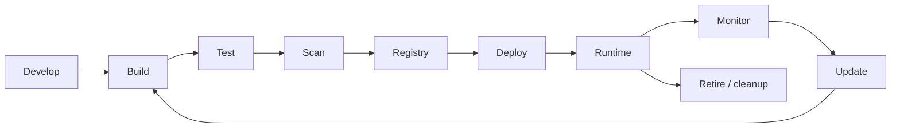

# Container lifecycle demo

End-to-end sample: a small Node.js API, Docker, optional GKE, GitHub Actions, and Python helpers for compliance-style checks. The app stays small so the pipeline and ops pieces stay easy to read.

## Prerequisites

| Tool | Notes |
|------|--------|
| Node.js 18+ | App and CI tests |
| Docker | Local image build / Compose |
| `gcloud`, `kubectl` | Only if you use GCP/GKE |
| Python 3.8+ | `scripts/*.py` (see [Python scripts](#python-scripts)) |
| Git | Clone and push |

Optional: **Trivy** (image scan), **Cosign** (signing), **Syft** (SBOM), **container-structure-test** (structure tests; CI downloads it).

## Quick start (local)

```bash
cd app
npm ci
npm test
npm run lint
npm start
```

- JSON API root: `http://localhost:3000/`
- Browser helper: `http://localhost:3000/index.html`

## Docker

From the repository root:

```bash
docker build -f docker/Dockerfile --target production -t container-lifecycle-demo:local .
docker run --rm -p 3000:3000 container-lifecycle-demo:local
```

Compose (from `docker/`):

```bash
cd docker && docker compose up --build app
```

Optional monitoring profile (Prometheus + Grafana; Grafana on host port **3002**):

```bash
cd docker && docker compose --profile monitoring up -d prometheus grafana
```

Repo config: `monitoring/prometheus.yml`. There is no `k8s/monitoring/` path—deploy Prometheus/Grafana yourself or use Compose.

## Google Cloud (condensed)

```bash
gcloud auth login
export PROJECT_ID="your-gcp-project-id"
gcloud config set project "$PROJECT_ID"

gcloud services enable container.googleapis.com containerregistry.googleapis.com compute.googleapis.com
```

Create a GKE cluster (example—sizes/zones are yours to tune):

```bash
gcloud container clusters create container-lifecycle-cluster \
  --zone us-central1-a \
  --num-nodes 3 \
  --enable-autoscaling --min-nodes 1 --max-nodes 5 \
  --machine-type n1-standard-2

gcloud container clusters get-credentials container-lifecycle-cluster --zone us-central1-a
```

## Kubernetes

1. Set the image in `k8s/deployment.yaml` (placeholder: `gcr.io/YOUR_GCP_PROJECT/container-lifecycle-demo:latest`).
2. Apply in order:

```bash
kubectl apply -f k8s/namespace.yaml
kubectl apply -f k8s/rbac.yaml
kubectl apply -f k8s/deployment.yaml
kubectl apply -f k8s/service.yaml
```

Match `imagePullSecrets` / workload identity to how your cluster pulls from GCR or Artifact Registry.

Verify:

```bash
kubectl get deployments,pods -n container-lifecycle-demo
kubectl rollout status deployment/container-lifecycle-demo -n container-lifecycle-demo
```

## GitHub Actions and secrets

| Secret | Purpose |
|--------|---------|
| `GCP_PROJECT_ID` | GCP project id |
| `GCP_SA_KEY` | Service account JSON (push images, GKE deploy, scheduled jobs) |

Typical IAM roles for that account (adjust to your org): **Container Admin** (or narrower GKE deploy), **Storage Admin** (or Artifact Registry writer), **Compute** as needed for your setup.

The workflow builds `gcr.io/$PROJECT_ID/container-lifecycle-demo`, pins references by **digest** where possible, and deploys into namespace **`container-lifecycle-demo`**. Without secrets, the Node test/lint job can still run; GCP-dependent jobs will fail until configured.

## Environment variables (app)

| Variable | Purpose |
|----------|---------|
| `NODE_ENV` | `development` / `production` |
| `PORT` | Listen port (default `3000`) |
| `ALLOWED_ORIGINS` | Comma-separated CORS origins |
| `IMAGE_TAG`, `IMAGE_DIGEST`, `BUILD_TIME`, `GIT_COMMIT`, `VERSION` | Shown on `/lifecycle` when set |
| `K8S_NAMESPACE`, `K8S_POD_NAME` | Often from Kubernetes downward API in manifests |
| `SECURITY_SCANNED`, `VULNERABILITIES`, `COMPLIANCE_STATUS` | Optional `/lifecycle` metadata |

## Python scripts

Install once:

```bash
pip3 install -r scripts/requirements.txt
```

| Script | Purpose |
|--------|---------|
| `scripts/deployment-test.py` | HTTP smoke tests: `--url https://your-service` |
| `scripts/compliance-check.py` | Image checks: `--image gcr.io/PROJECT/IMG@sha256:...` (needs Docker/Trivy locally where used) |
| `scripts/generate-compliance-report.py` | Registry-oriented report: `--project-id YOUR_PROJECT` |

Example:

```bash
python3 scripts/deployment-test.py --url http://localhost:3000
python3 scripts/compliance-check.py --image container-lifecycle-demo:local
```

## Lifecycle at a glance

This repo is structured around a typical flow: develop → build image → test → scan → push to registry → deploy → run → observe → update → eventually retire old images.



**Stages (short):**

1. **Develop** – `npm run dev`, `npm test`, `npm run lint`, `npm audit`.
2. **Build** – Multi-stage `docker/Dockerfile`; non-root user in final image.
3. **Test** – Jest in `app/`; optional container-structure-test via `security/container-structure-test.yaml`.
4. **Scan** – Trivy/npm audit in CI; optional local Trivy.
5. **Registry** – Push to GCR (or equivalent); tag and track digests.
6. **Deploy** – `k8s/` manifests, rolling updates, probes on `/health` and `/readiness`.
7. **Runtime** – App exposes `/metrics` (in-process counters) and JSON endpoints.
8. **Monitor** – Prometheus scrape config example under `monitoring/`.
9. **Update** – New build through the same pipeline; `kubectl set image` or GitOps as you prefer.
10. **Retire** – Workflow schedule includes image cleanup patterns; tune retention to your policy.

## Troubleshooting

| Issue | What to try |
|-------|----------------|
| GKE / quota errors | `gcloud compute project-info describe --project=$PROJECT_ID` |
| Docker build flaky | `docker system prune -a` then rebuild with `--no-cache` |
| Pod not starting | `kubectl describe pod -n container-lifecycle-demo POD` and `kubectl logs` |
| App in cluster | `kubectl logs -l app=container-lifecycle-demo -n container-lifecycle-demo` |
| Trivy DB | `trivy image --download-db-only` |
| CI security gate | Fix critical `npm audit` issues in `app/` or adjust policy intentionally |

## Project layout

| Path | Purpose |
|------|---------|
| `app/server.js` | HTTP API |
| `app/tests/` | Jest + Supertest |
| `app/public/index.html` | Simple UI |
| `docker/` | Dockerfile, Compose |
| `k8s/` | Kubernetes manifests |
| `monitoring/prometheus.yml` | Example scrape config |
| `security/container-structure-test.yaml` | Structure tests |
| `scripts/` | Python utilities + `requirements.txt` |

## License

MIT (see `app/package.json`).
