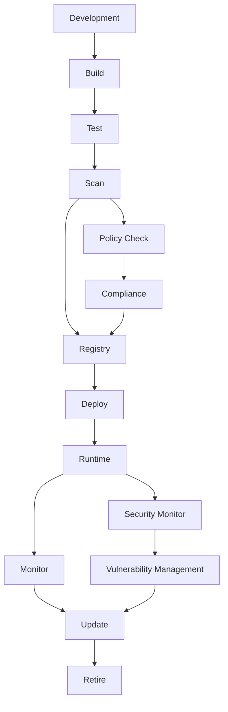

# Container Lifecycle Management Guide

This document outlines the complete container lifecycle management process implemented in this project, from development to retirement.

## 🔄 Lifecycle Stages Overview



## 📋 Stage 1: Development

### Secure Development Practices

- **Code Security**: Static analysis with ESLint and security rules
- **Dependency Management**: Regular `npm audit` and vulnerability checks
- **Secret Management**: No hardcoded secrets, environment variable usage
- **Testing**: Comprehensive unit and integration tests

### Development Tools

```bash
# Install development dependencies
npm install

# Run security audit
npm audit --audit-level=high

# Run tests with coverage
npm run test:coverage

# Local development with hot reload
npm run dev
```

### Security Checklist

- ✅ No hardcoded credentials
- ✅ Input validation implemented
- ✅ Error handling without information leakage
- ✅ Security headers configured
- ✅ Dependencies regularly updated

## 🏗️ Stage 2: Build

### Multi-Stage Docker Build

The Dockerfile implements security best practices:

```dockerfile
# Security-focused multi-stage build
FROM node:18-alpine AS base
# Security updates and minimal packages
RUN apk update && apk upgrade

FROM base AS dependencies
# Production dependencies only
RUN npm ci --only=production --no-audit

FROM base AS production
# Non-root user configuration
USER nodejs
```

### Build Process

1. **Base Image Selection**: Alpine-based for minimal attack surface
2. **Dependency Installation**: Separate stage for dependency management
3. **Security Scanning**: Integrated vulnerability assessment
4. **Multi-stage Optimization**: Minimal final image size

### Build Automation

```bash
# Local build
docker build -f docker/Dockerfile -t container-lifecycle-demo:local .

# Build with metadata
docker build \
  --build-arg BUILD_TIME=$(date -u +"%Y-%m-%dT%H:%M:%SZ") \
  --build-arg GIT_COMMIT=$(git rev-parse HEAD) \
  --build-arg VERSION=1.0.0 \
  -f docker/Dockerfile \
  -t container-lifecycle-demo:$(git rev-parse --short HEAD) .
```

## 🧪 Stage 3: Test

### Testing Strategy

1. **Unit Tests**: Application logic validation
2. **Integration Tests**: API endpoint testing
3. **Security Tests**: Container structure validation
4. **Performance Tests**: Load and response time testing

### Automated Testing

```bash
# Application tests
npm test

# Container structure tests
container-structure-test test \
  --image container-lifecycle-demo:local \
  --config security/container-structure-test.yaml

# Security policy tests
opa test security/policies/
```

### Test Coverage Requirements

- **Code Coverage**: Minimum 80%
- **Security Tests**: All security policies must pass
- **Performance Tests**: Response time < 500ms average
- **Compliance Tests**: All governance policies validated

## 🔍 Stage 4: Security Scanning

### Vulnerability Assessment

Multiple scanning layers for comprehensive security:

1. **OS Package Scanning**: Base image vulnerabilities
2. **Application Dependencies**: Node.js package vulnerabilities  
3. **Configuration Scanning**: Dockerfile and runtime configuration
4. **Secret Detection**: Embedded credentials and keys

### Scanning Tools Integration

```bash
# Trivy comprehensive scan
trivy image --format sarif --output report.sarif container-lifecycle-demo:latest

# Generate SBOM
syft packages container-lifecycle-demo:latest -o spdx-json

# Policy validation
opa eval -d security/policies/ -i image-metadata.json "data.image.allow"
```

### Vulnerability Thresholds

| Severity | Action |
|----------|---------|
| **Critical** | Block deployment, immediate fix required |
| **High** | Warn, fix within 7 days |
| **Medium** | Track, fix within 30 days |
| **Low** | Monitor, fix during regular updates |

## 📦 Stage 5: Registry Storage

### Image Registry Management

- **Registry**: Google Container Registry (GCR)
- **Tagging Strategy**: Semantic versioning + commit hash
- **Image Signing**: Cosign integration for supply chain security
- **Metadata**: Comprehensive labeling for lifecycle tracking

### Tagging Strategy

```bash
# Semantic versioning
gcr.io/PROJECT_ID/container-lifecycle-demo:v1.2.3

# Git commit hash
gcr.io/PROJECT_ID/container-lifecycle-demo:abc123f

# Environment tags
gcr.io/PROJECT_ID/container-lifecycle-demo:prod-v1.2.3
gcr.io/PROJECT_ID/container-lifecycle-demo:staging-latest

# Deployment tracking
gcr.io/PROJECT_ID/container-lifecycle-demo:deployed-20231027
```

### Image Metadata Labels

```yaml
labels:
  org.opencontainers.image.title: "Container Lifecycle Demo"
  org.opencontainers.image.version: "1.2.3"
  org.opencontainers.image.created: "2023-10-27T10:30:00Z"
  org.opencontainers.image.revision: "abc123f"
  lifecycle.stage: "production"
  security.scanned: "true"
  compliance.validated: "true"
  vulnerability.critical: "0"
  vulnerability.high: "2"
```

## 🚀 Stage 6: Deployment

### Kubernetes Deployment

Secure deployment configuration with:

- **Security Context**: Non-root user, read-only filesystem
- **Resource Limits**: CPU and memory constraints
- **Health Checks**: Liveness, readiness, and startup probes
- **Network Policies**: Traffic isolation and security

### Deployment Process

```bash
# Deploy to Kubernetes
kubectl apply -f k8s/

# Verify deployment
kubectl get deployments -n container-lifecycle-demo
kubectl rollout status deployment/container-lifecycle-demo -n container-lifecycle-demo
```

### Rolling Update Strategy

```yaml
strategy:
  type: RollingUpdate
  rollingUpdate:
    maxUnavailable: 1
    maxSurge: 1
```

### Pre-deployment Validation

1. **Security Scan**: No critical vulnerabilities
2. **Image Verification**: Signature validation  
3. **Resource Availability**: Cluster capacity check
4. **Kubernetes Security**: Security context validation

## 🏃 Stage 7: Runtime

### Runtime Security

- **Security Contexts**: Policy enforcement at deployment
- **Runtime Monitoring**: Continuous security assessment
- **Anomaly Detection**: Behavioral analysis and alerting
- **Resource Monitoring**: Performance and usage tracking

### Security Controls

```yaml
securityContext:
  runAsNonRoot: true
  runAsUser: 1001
  readOnlyRootFilesystem: true
  allowPrivilegeEscalation: false
  capabilities:
    drop: ["ALL"]
```

### Health Monitoring

```bash
# Health check endpoint
curl http://app-url/health

# Readiness check
curl http://app-url/readiness

# Application metrics
curl http://app-url/metrics
```

## 📊 Stage 8: Monitoring

### Monitoring Stack

- **Metrics Collection**: Prometheus
- **Visualization**: Grafana dashboards
- **Alerting**: Alert Manager integration
- **Log Aggregation**: Centralized logging solution

### Key Metrics

1. **Application Metrics**
   - Response time
   - Error rate
   - Request volume
   - Resource utilization

2. **Security Metrics**
   - Vulnerability count
   - Policy violations
   - Security incidents
   - Compliance score

3. **Lifecycle Metrics**
   - Image age
   - Deployment frequency
   - Update success rate
   - Storage utilization

### Alerting Rules

```yaml
groups:
- name: container_lifecycle_alerts
  rules:
  - alert: HighVulnerabilityCount
    expr: vulnerability_critical_count > 0
    labels:
      severity: critical
    annotations:
      summary: "Critical vulnerabilities detected"
      
  - alert: DeploymentFailure
    expr: kube_deployment_status_replicas_unavailable > 0
    labels:
      severity: warning
    annotations:
      summary: "Deployment has unavailable replicas"
```

## 🔄 Stage 9: Updates

### Update Process

1. **Vulnerability Assessment**: Regular security scanning
2. **Dependency Updates**: Automated dependency management
3. **Base Image Updates**: Regular base image refresh
4. **Security Patches**: Priority patching for critical issues

### Automated Updates

```bash
# Dependency updates
npm update
npm audit fix

# Base image updates (monthly)
docker pull node:18-alpine

# Security patch deployment
kubectl set image deployment/container-lifecycle-demo \
  container-lifecycle-demo=gcr.io/PROJECT_ID/container-lifecycle-demo:v1.2.4
```

### Update Validation

- ✅ Security scan passes
- ✅ All tests successful
- ✅ Policy compliance maintained
- ✅ No service disruption
- ✅ Rollback plan prepared

## 🗑️ Stage 10: Retirement

### Image Lifecycle Management

Automated cleanup based on:

- **Age**: Images older than 90 days
- **Usage**: Unused images (not deployed)
- **Vulnerability Status**: High-risk images
- **Storage Optimization**: Large unused images

### Cleanup Process

```bash
# Automated cleanup (runs weekly)
gcloud container images list-tags gcr.io/PROJECT_ID/container-lifecycle-demo \
  --filter="timestamp.datetime < '-P90D'" \
  --format="get(digest)" | \
  xargs -I {} gcloud container images delete gcr.io/PROJECT_ID/container-lifecycle-demo@{} --quiet
```

### Retention Policies

| Category | Retention Period |
|----------|------------------|
| **Production Tags** | 1 year |
| **Development Tags** | 30 days |
| **Feature Branch Tags** | 7 days |
| **Vulnerability Images** | Immediate cleanup |

### Data Archival

Before deletion:

1. **Compliance Records**: Archive security scan results
2. **Metadata Backup**: Save image metadata and labels
3. **Audit Trail**: Document deletion reasons and timeline
4. **Recovery Plan**: Maintain rebuild capability

## 🔐 Security Throughout Lifecycle

### Continuous Security

1. **Shift-Left Security**: Early vulnerability detection
2. **Runtime Protection**: Continuous monitoring and response
3. **Policy Enforcement**: Automated governance controls
4. **Compliance Reporting**: Regular audit and assessment

### Security Automation

```bash
# Daily security scan
0 2 * * * /usr/local/bin/trivy image --format json gcr.io/PROJECT_ID/container-lifecycle-demo:latest > /var/log/security-scan.json

# Weekly compliance report
0 6 * * 1 python3 /opt/scripts/generate-compliance-report.py --project-id PROJECT_ID

# Monthly cleanup
0 3 1 * * /opt/scripts/lifecycle-cleanup.sh
```

## 📈 Metrics and KPIs

### Lifecycle KPIs

1. **Security Score**: Average security posture across images
2. **Compliance Rate**: Percentage of policy-compliant deployments
3. **Vulnerability MTTR**: Mean time to resolve security issues
4. **Deployment Success Rate**: Successful deployment percentage
5. **Storage Efficiency**: Storage utilization optimization

### Reporting

- **Daily**: Security scan results and compliance status
- **Weekly**: Lifecycle metrics and trends analysis
- **Monthly**: Comprehensive compliance report
- **Quarterly**: Security posture assessment and recommendations

---

This lifecycle management approach ensures secure, compliant, and efficient container operations from development through retirement, with automated governance and continuous security monitoring throughout each stage.
